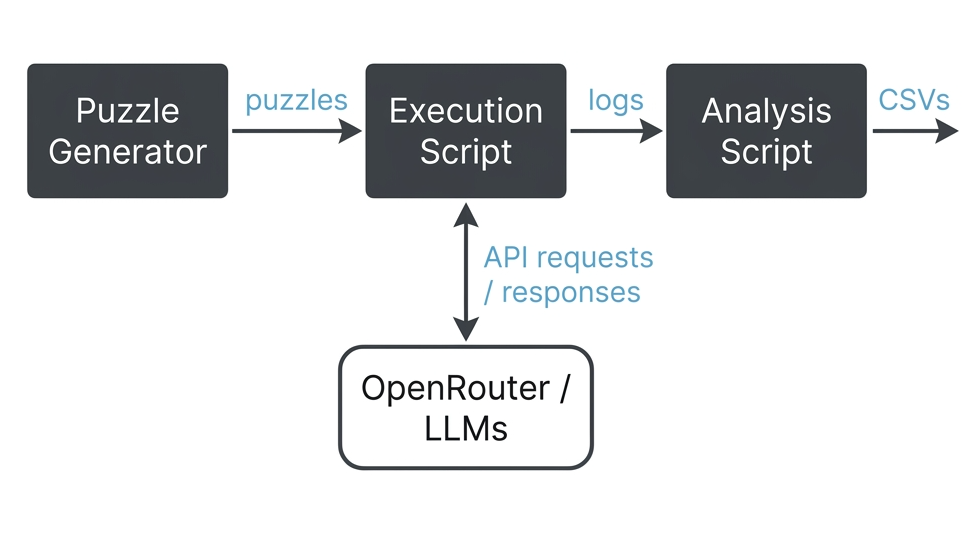

# Executive Summary

I reimplemented the same ~800 line Python Puzzle Evaluator program more than 10 times across three AI assisted coding approaches, measuring active developer time and qualitative experience for each.

| Approach | Time | Key Tradeoff |
|:---|:---|:---|
| Agent Driven | 7h 0m | High review overhead and frequent context switching |
| Agent Driven w/ Test Suite | 2h 41m | Fast implementation, but upfront test creation required |
| Human Driven | 2h 27m | Fastest overall, but requires full attention throughout |

**Agent Driven:** An agent drove the full implementation from an open-ended prompt. It felt productive in the moment, but the hidden costs added up. Reviewing and correcting the agent's output was taxing ("it is harder to read code than to write it"), and I had to context switch often while waiting for the agent to complete tasks. That said, this approach shines for prototyping and working in unfamiliar domains.

**Agent Driven w/ Test Suite:** With the addition of a test suite, Antigravity completed the entire implementation in just 33 minutes with minimal intervention. But that test suite took 2+ hours to create even with a reference implementation to start from — a shortcut most real world projects won't have. And even with clear specifications, agents can still go off course. Claude Code burned a ton of tokens to create some very impressive algorithms, but lacked the sense to know when a simple solution was the right one.

**Human Driven:** I designed the architecture and handed off small, well scoped modules to the agent. With each task kept small and constrained, there was almost no review overhead and I never had to correct a bad architectural decision. It felt like a supercharged version of the way I used to program. That said, unlike the agentic approaches, it demands your full attention throughout.

I was surprised that the **Human Driven** approach was the fastest, even in March 2026. However, every approach has its place. Agentic vibe coding has a clear role in prototyping and exploration, but still carries huge risks in production without human oversight. Constraining the agent with a test suite mitigates most of these risks, but requires an upfront investment in specification that rarely exists in real world software development. For now, an experienced developer augmented by AI remains more powerful than either one working alone.

# Introduction

AI assisted coding has irrevocably changed the way we code today, but there is a wide spectrum of approaches, ranging from fully hands-off agentic workflows to using LLMs only as a smarter Stack Overflow. There is commercially driven hype around agentic AI on one side and unwarranted skepticism grounded in fear and ego on the other.

As a developer, I wanted to objectively understand the effectiveness of these different approaches, but I hadn't seen any truly apples-to-apples comparisons in the online discourse. Because developers work with different tech stacks and domains, a fully agentic workflow that works well for a frontend React developer can completely fall apart for an embedded C developer. So I ran my own experiment and reimplemented a benchmark program more than 10 times across different AI coding approaches to compare them head to head.

# Benchmark Program (Zebra Puzzle Evaluator)
*[Source code](reference-impl/)*

In a past side project, I developed a small CLI application (~800 lines of Python) that evaluates LLM logical reasoning capability by procedurally generating Zebra-style constraint satisfaction puzzles of varying difficulty and evaluating model responses against a ground truth solution. I chose it as the benchmark because it is complex enough to present non-trivial engineering challenges, but constrained enough to implement fully in a single session.

Here is an example of a simple 3-person, 2-attribute Zebra puzzle:

> **Question:** Given three people (Alice, Bob, Charlie), determine each person's drink and house color.
>
> **Possible Attribute Values:**
> - Drink: coffee, tea, milk
> - House Color: red, blue, green
>
> **Clues:**
> 1. Alice drinks coffee.
> 2. The person who drinks tea lives in the blue house.
> 3. Bob does not live in the red house.
> 4. Charlie lives in the green house.



### High Level Requirements

The benchmark program consists of three components:
- **Puzzle generator** — procedurally creates uniquely solvable puzzles of varying difficulty (1–20 people, 1–20 attributes each).
- **Execution script** — batch-runs puzzles against a configurable set of LLM models via OpenRouter and logs results.
- **Analysis script** — aggregates results across puzzle configurations into CSV tables to compare model performance across difficulty levels.

<details>
<summary>Detailed Requirements</summary>

### Functional Requirements

**Puzzle Generation:**
1. The puzzle generator procedurally generates uniquely solvable randomized Zebra puzzles, validated by a CSP solver.
2. The puzzle generator supports varying difficulty, from 1 person with 1 attribute up to 20 people with 20 attributes each.
3. The generated prompt includes natural language clues, a list of all possible attributes and their values, and instructions to output the solution in JSON format with an example.

**Execution & Evaluation:**
1. The execution script batch executes puzzle generation and evaluation across a configurable range of puzzle configurations and LLM models, specified via command line arguments.
2. The execution script evaluates response correctness for each run by exact match against the expected solution.
3. The execution script logs the puzzle prompt, expected solution, and correctness result for each execution so that individual runs can be retried.

**Analysis:**
1. The analysis script aggregates results for a single model by processing its log directory and outputting a single CSV containing four tables: pass rates, correct runs, total runs, and error counts.
2. For each table, each row represents a number of people and each column a number of attributes, so the value at row 5, column 3 gives the stat for a 5-person, 3-attribute puzzle.
3. The user runs the script separately for each model and compares the resulting CSVs to evaluate correctness over difficulty and performance across models.

### Non-Functional Requirements

1. The program is implemented in Python 3.
2. The puzzle generator uses the python-constraint library as the Constraint Satisfaction Problem (CSP) solver to validate puzzle uniqueness.
3. The execution script uses the OpenAI Response API for all LLM interactions.
4. The execution script logs the full OpenRouter API response, parsed LLM solution, and all errors and exceptions encountered during execution.
5. The puzzle generator produces puzzles up to 20×20 in size in under 10 seconds.
6. The execution script runs puzzle and model configuration pairs in parallel, supporting up to 10,000 concurrent executions.

</details>

# Methodology

I reimplemented the Zebra Puzzle Evaluator with 3 different approaches, ensuring each implementation met the exact functional and nonfunctional requirements of the original program. The approaches are:

1. **Agent Driven:** Provide basic requirements, let the agent ask clarifying questions and generate a solution, then review and revise.
2. **Agent Driven w/ Test Suite:** Provide basic requirements alongside a comprehensive test suite to guide the agent's autonomous iteration.
3. **Human Driven:** Prompt the agent to implement small, isolated modules, then manually stitch them together.

Because all three approaches produced the same end result, I could evaluate them along two axes:

**Quantitative (Time):** I tracked active developer time—prompting, reviewing, revising, and verifying standard behavior. If an agent ran autonomously for more than two minutes, I context-switched and excluded that waiting period. Therefore, reported times reflect active human effort rather than wall-clock time.

**Qualitative (Effort):** I evaluated the overall level of effort required, the level of autonomy the agents actually achieved, and how the overall workflow felt from a human software engineering perspective.

# Results by Approach

## Approach #1: Agent Driven Implementations
*[Source code](agent-driven/)*

```
Prompt → Clarifying Q&A → Agent implements → Human reviews → Agent revises → Repeat until complete
```

This approach mirrors how I would naturally work with an AI agent on a new project. I start with only a general idea of what I want to build, with no detailed requirements and no test suite. I gave each agent a deliberately open-ended prompt:

> I would like to write a python program to generate a set of logic puzzles along with their solutions, send them to llms via open router, and then compare the llm generated solutions to the actual solutions. These are not complete requirements. Please ask me all the clarifying questions that you need.

From there, the agent leads with clarifying questions to nail down requirements, then drives the implementation. I provide as little explicit instruction as possible to see if it has good intuition about higher-level architecture, while steering it toward the same functionality as my original implementation.

I vaildate the agent's implementation as it presents them. The agent runs its own tests and self corrects, but these are not comprehensive. I verify correctness by manually running the program and validating its input and output behavior. For logic that is difficult to test this way, like CSP based puzzle uniqueness validation, I review the code in detail. When the code does not meet the requirements, I prompt the agent to revise the implementation, but I try to let it decide the how as much as possible. I repeat this process until the code meets all functional and nonfunctional requirements. I deliberately avoided creating a test suite during this process, since I wanted to evaluate agent performance without one (that experiment comes in Approach #2).

To evaluate this approach, I ran it with five agents: Anti Gravity (w/Gemini 3 Pro), Copilot, Cursor, Cline, and Claude Code (all w/Claude Sonnet 4.5). The discussion below focuses on Claude Code, which was the best performer of the five and serves as the representative for this approach. A full breakdown of all five agents is in [AI Coding Agent Comparison](agent-driven/agent-comparison.md).

### How It Played Out

As a code generator, Claude Code was very impressive. It wrote clean, Pythonic, procedural Python without reaching for unnecessary class hierarchies. It one-shotted many significant pieces of the implementation, including the parallelized batch LLM evaluation logic. It proactively ran the program to verify its own work and iterated on failures without being asked, though the tests it independently chose to run were not comprehensive. It also demonstrated strong algorithmic creativity by devising a deterministic method for generating uniquely solvable clue sets, an approach I had considered for my original implementation but abandoned because of the complexity.

As a collaborator, the agent started strong. It asked excellent clarifying questions after receiving the initial prompt, pulling out more or less all of the functional requirements without me having to drive the conversation. However, it did not ask the right questions to elicit the nonfunctional requirements on its own.

However, the agent needed higher level architectural guidance. While it arrived at the correct batch evaluate then analyze architecture through its questions, it didn't understand why that architecture existed. The batch evaluation takes a long time and is expensive to retry in its entirety. As a result, I had to explicitly instruct it about logging and error handling so that partial batch failures could be retried without rerunning the entire evaluation. It also initially included a clue type that made CSP validation extremely slow, and I had to intervene to remove it. Left to its own devices, the agent would have kept trying to make it work even when it was computationally infeasible.

I also encountered the commonly discussed pitfalls of agentic coding:

1. The agent took shortcuts. It initially skipped using the CSP solver to verify puzzle uniqueness, a key requirement, and had to be reminded.
2. It defaulted to older APIs based on its training cutoff. For example, it used the Chat Completion API rather than the Response API needed for configuring reasoning effort.
3. It added excessive fallback and retry logic by default.
4. The agent was also not always self consistent. It didn't generate enough values in an attribute enum despite knowing the program needed to support 20x20 puzzles, and it proposed one strategy for generating clues in its plan but implemented a different one.

These issues are all easy to get the agent to fix, but they underscore the need to still review agent generated code.

Where the agent struggled most was running iterative experiments to solve a novel problem. The puzzle generator needed to produce 20x20 puzzles in under 10 seconds, and the agent's initial implementation was too slow. I prompted it to speed up the implementation and it proposed reasonable optimizations, but it couldn't effectively experimentally validate it's proposals. Its implementation was already too slow to benchmark, yet it repeatedly tried to sample runtimes without placing timeouts on its runs, getting stuck indefinitely on the very problem it was trying to solve. I had to explicitly instruct it to add timeouts and use smaller puzzle sizes. 

The agent was also drawn to overengineered solutions. It tried to replace the CSP solver with custom uniqueness checking code. While technically impressive, this is quite complex and involves reimplementing much of the CSP solver's core logic from scratch. A much simpler heuristic to initialize a large batch of clues before calling the CSP solver would be sufficient, which is what I explicitly instructed the agent to use.

### Time & Effort
**Total Time Taken:** 7h 0m

Overall, this approach felt highly productive in the moment. I was impressed by the agent's ability to drive the implementation, even if it did need my guidance on the architecture and performance optimization. If we rewind just one or two years, watching an AI build a full application from an open-ended prompt would have been a magical experience.

However, it still took 7 hours of active human effort to reach a working implementation. That figure excludes the time the agent spent running autonomously in the background. My active time was overwhelmingly dominated by reviewing, debugging, and correcting the agent's generated code. For many developers, myself included, reviewing large chunks of unfamiliar code is far more mentally draining than simply writing it.

Furthermore, the approach required a highly fragmented workflow. Whenever the agent needed more than five minutes to complete a task, I would switch to something else to avoid dead time. I had to do this over 15 times throughout the project, which made it difficult to maintain momentum. While having an autonomous AI partner felt productive in the moment, the heavy burden of code review drove up the active human effort, while the frequent context switching created a significant hidden mental tax.


## Approach #2: Agent Driven w/ Test Suite
*[Source code](agent-driven-w-tests/)*

```
Create test suite → Agent implements & self-test → Human verifies
```

This approach explores the maximal autonomous capabilities of AI coding assistants by providing them with a strict, executable functional specification in the form of a test suite. While many developers are already comfortable letting agents like Claude Code operate autonomously without such guardrails, it is very difficult to objectively evaluate their output in that manner. Using a test suite forces the agent to produce a working implementation that is comparable to the other approaches. Furthermore, Anthropic's recent success building a C compiler with autonomous agents demonstrated that a test suite is often the critical enabler for this kind of work.

### Phase 1: Test Suite Creation
**Time Taken:** 2 hours 8 minutes

I used Claude Code to generate the test suite based on my baseline implementation and the functional and non-functional project requirements. While it generated a decent set of initial tests, it still required significant human guidance to get right. Specifically, I had to prompt the agent to use the CSP solver in the tests to verify that generated puzzles were valid and possessed a unique solution. I also had to explicitly enforce a 15 second timeout on the puzzle generation performance tests so they wouldn't run indefinitely, and I had to instruct the agent to test for a reasonable distribution of clue types based on the baseline implementation. The final test suite consisted of 36 tests across roughly 550 lines of Python code.

### Phase 2: Agent Implementation

Once the test suite was ready, I used the two best-performing agents from Approach #1 to implement the Zebra Puzzle Evaluator. I provided them with the test suite and a similar initial prompt:

> I would like to write a python program to generate a set of logic puzzles along with their solutions, send them to llms via open router, and then compare the llm generated solutions to the actual solutions. Tests are located in the /tests directory and directions are located in IMPLEMENTATION_GUIDE.md. Your implementation must pass all tests.

I set the agents to work as autonomously as possible. I granted them maximally permissive execution rights, approved all requested actions, and only intervened when absolutely necessary. After an agent declared it was finished, I ran the test suite and performed the same manual validation used in Approach #1 to ensure a fair comparison.

#### Antigravity (w/Gemini 3.1 Pro)
**Time Taken:** 33 minutes

Given the initial prompt and test suite, Antigravity completed the entire implementation in just 33 minutes. It autonomously iterated without any human intervention until every test passed and it intuited all of the functional and non-functional requirements without needing to ask me clarifying questions. The test suite's 15 second timeout also enabled Antigravity to fullfill the puzzle generation performance requirement without getting stuck like Calude Code did in Approach #1. The only minor flaw with its initial implementation was using placeholder strings like "Attribute_0" and "Value_0", which it quickly fixed when prompted.

#### Claude Code (w/Claude Sonnet 4.6)
**Time Taken:** 2 hours 16 minutes

Given the same prompt and test suite, Claude Code ran into some problems. Its main roadblock was a test specifying a certain distribution of clue types. The agent attempted to design multiple complex algorithms to match the requirement perfectly. While its reasoning traces and attempted implementations were fascinating to watch, the process consumed a massive amount of time and tokens. Although it did eventually produce a working implementation, the resulting code was vastly more complicated than necessary.

In contrast, Antigravity used a much simpler heuristic for the same requirement: it deterministically generated the minimum set of clues needed to guarantee a unique puzzle, then simply padded the remainder to satisfy the distribution constraint. That is exactly what I would have done as a human coder. Claude Code performed like a very talented, enthusiastic junior engineer who is creative and sophisticated, but lacked the experience to know when to stop and use a simple solution.

### Time & Effort
**Total Time Taken:** 2h 41m (Test Suite Generation + Agent Implementation for Antigravity)

Using Antigravity as the exemplar, the raw speed and autonomy of the implementation phase is incredible. It was more than 10x faster than the plain agent driven approach. If agents can reliably implement programs this way, it really would be possible for a single experience software developer to orchestrate a team of agents operating in parallel. 

However, the total time jumps significantly once you factor in test suite generation, and my approach was a shortcut since I already had a baseline implementation to work from. Most real-world projects won't have that luxury, and writing a comprehensive test suite from scratch before any implementation exists is a significant challenge. My intuition as a coder is that interactively exploring a problem space via coding is going to be faster than trying to comprehensively nail down a specification beforehand.

Finally, Claude Code's over engineering of the clue distribution requirement shows that agents can still easily go off course even with a comprehensive functional specification. I suspect an agent's ability to autonomously iterate is highly dependent on the specific problem domain and its training data. So while this test driven approach shows tremendous potential, it isn't quite there yet.

## Approach #3: Human Driven Implementation
*[Source code](human-driven/)*

```
Human designs architecture & splits out modules → Agent implements module → Human reviews & integrates
```
In this approach, the human maintains the mental picture of how the program should be structured and hands off only small, well-scoped modules to the AI coding assistant. I used Claude Code (w/Claude Sonnet 4.6), since it was the best performer from Approach #1. This is the approach I take by default, though I was starting to wonder if it was antiquated in 2026. For the Zebra Puzzle Evaluator, examples of individual offloaded tasks include:

- Translating puzzle clues into CSP constraints
- Implementing the clue generation workflow with CSP-based uniqueness verification
- Implementing parallelized batch model evaluation via the OpenAI Response API
- Generating the entire analysis script from a single prompt

I verified each task immediately after the agent implemented it, making corrections directly in the IDE diff. After the full implementation was complete, I performed the same manual verification used in Approach #1 to ensure comparability across all three approaches.

### How It Played Out

The agent performed very well on the modules I offloaded to it, implementing almost all of them correctly in a single shot. Tasks like translating puzzle clues into CSP constraints, implementing parallelized batch calls to the OpenRouter API, and generating the entire analysis script from a single prompt would have been very time consuming to write by hand.

I spent very little time reviewing and revising the agent's work. Because each task was small and self contained, even the more complex modules like the CSP verification of puzzle uniqueness were easy to review. I also never had to steer the agent away from bad architectural decisions or over engineered solutions, so course correction was minimal. The key to being productive here is keeping all tasks small and easy to verify.

I then stitched together the modules by hand, which felt extremely satisfying. It was like a supercharged version of the way I used to program, because all the tedious implementations were taken care of by the agent and I could build, test, and iterate much more quickly.

### Time & Effort
**Total Time Taken:** 2h 27m

At roughly 2.5 hours, this approach took about a third of the time of the fully agent driven Approach #1. The approach I thought might be antiquated turned out to be the most effective one I tested. By making the high level design decisions myself, I eliminated the overhead of reviewing large chunks of code, correcting bad architectural choices, and steering the agent away from over engineered solutions. The agent was most effective when I gave it a clear, constrained task and let it execute, rather than asking it to figure out what to build.

The entire process was smooth and trouble free. I was always engaged and iterating quickly, never waiting too long for the agent to finish or context switching to fill dead time. That said, this approach does demand your full attention as a developer. Unlike the agent driven approaches, you cannot have the agent work in the background while you do something else. But even beyond the time savings, I found this approach very satisfying as a software developer. I still got to build and shape the code myself, just faster and without the tedious bits.


# Cross-Approach Comparison

| Approach | Prep Time | Impl. Time | Total Active Time | Subjective Notes |
| :--- | :--- | :--- | :--- | :--- |
| **#1: Agent Driven** | 0h 0m | 7h 0m | **7h 0m** | High mental load from code review and context switching |
| **#2: Agent Driven w/Tests**| 2h 8m | 0h 33m | **2h 41m** | Need to write tests upfront; agent can still go off course |
| **#3: Human Driven** | 0h 0m | 2h 27m | **2h 27m** | Most engaging for human coder, but requires full attention |

The human-driven workflow (Approach #3) resulted in the lowest total active time at 2 hours and 27 minutes. The agent driven with tests workflow (Approach #2) followed closely at 2 hours and 41 minutes, though its time was heavily weighted toward upfront preparation rather than implementation. The agent driven without tests workflow (Approach #1) took significantly longer at 7 hours, but did not require any upfront preparation. There are nuances to each approach that make them more or less suitable depending on the specific circumstances. 

# Limitations

The results of this case study are specific to the tools I used (Claude Code w/Claude Sonnet, and Antigravity w/Gemini 3.1 Pro) and the specific problem I was solving (the Zebra Puzzle Evaluator). An agent's ability to autonomously implement a program is highly dependent on the problem domain and the model's training data. Python is a relatively simple language with a large amount of training data, so agents are likely to perform better on it than on more obscure languages. Conversely, the CSP solver used in this project is not a commonly used library. This is also a single-operator study, so my coding style, domain expertise, and preferences all influence the results.

The benchmark program itself is fairly simple and niche. It does not represent the common CRUD web and mobile applications that most developers work on, where agents may perform significantly better due to the abundance of similar code in their training data. I also only tested a limited set of models. Claude Code with Opus in particular was excluded due to its cost. Finally, these results are a snapshot of the AI coding landscape in March 2026. Model capabilities are improving rapidly, and the relative effectiveness of these approaches could shift significantly.


# Conclusion

The most surprising result of this case study is that the human-driven approach was the fastest. The old software engineering adage that "it is harder to read code than to write it" is just as relevant as ever. Reviewing agent-generated code and working with it to get it correct took roughly three times longer than designing the architecture myself and handing off targeted modules. For an experienced developer, using an agent as a targeted implementation tool can still be the most efficient and engaging way to work. That said, I suspect the fastest approach varies significantly by problem domain and tech stack.

The test-suite driven approach showed a lot of potential. With good documentation and a comprehensive test suite, the agent achieved a level of autonomy that can truly enable a single engineer to supervise multiple agents working in parallel. However, this requires an environment that rarely exists in reality. In my ten years of experience as a software engineer across FAANG and smaller tech companies, specs are usually out of date before the ink dries and scattered across tickets and wikis. Even when management enforces high code coverage, the teams tend to create performative tests rather than a comprehensive suite. Teams could certainly invest in maintaining up-to-date specs and tests to make this approach work, but it would require a significant shift from how most software is built.

Even fully open-ended "vibe coding" has its place. For problem areas where the developer lacks domain knowledge, having an agent generate a first draft is a useful way to learn the landscape quickly, and it is game changing for creating proof of concepts. However, the common pitfalls of vibe coding are still very real. Without an experienced developer verifying the output, you risk encountering security, performance, maintainability, and architectural issues in production.

In March 2026, AI coding tools provide a spectrum of approaches to software development, each with its own strengths and weaknesses. Despite the hype around agentic coding, human-driven coding can still be the most effective approach for many circumstances. At the same time, agentic approaches unlock rapid development in specific situations that would not be possible for a developer to achieve on their own. Like many developers, I'm anxious about the future of software development. But for now, human expertise is still tremendously valuable, and an experienced developer augmented by AI tools is more powerful than ever.